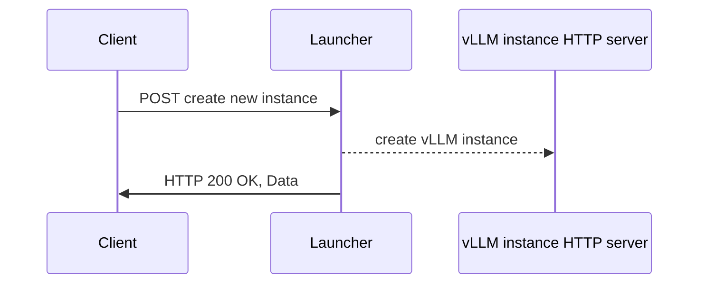
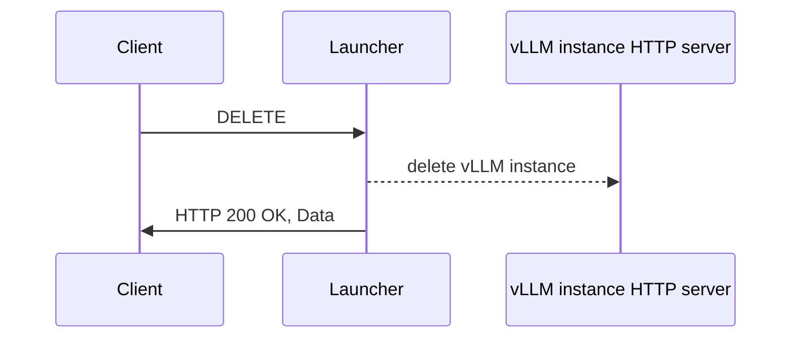
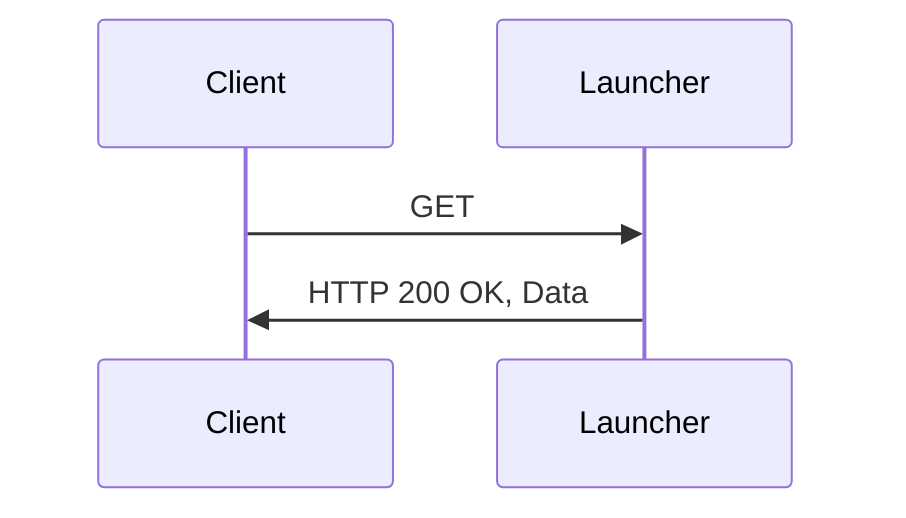

# vLLM Launcher

## Description

This document describes a vLLM launcher that can be used to achieve model swapping without changes to vLLM. The launcher initializes and manages a subsidiary inference vLLM server and responses with the PID. The launcher does basic vLLM code loading and initialization work (like import modules) of the inference server so that this work does not have to be done at the startup of the inference server process, reducing the startup latency. In future work, the launcher could be extended to sleep and wake up the inference servers that have been initialize by its POST request, and support mutiple instances.

## Launcher Methods and functionalities

The client/user will use a launcher-specific command to run the launcher. To swap a model in, the Client will issue a POST request (to the launcher) that includes the model reference and other command line flags. The launcher sends an `OK` response to the client/controller to indicate that queries can be sent to the vLLM instance directly. Upon receiving this response, the vLLM instance has not been fully guaranteed to be in a specific state. It may have executed few or no instructions, might not be listening on any port, and so forth.

Setting up process to create a new vLLM inference instance using POST:



An example of a CURL command that could be sent to the launcher can be seen below:

```bash
curl -X POST \
  -H "Content-Type: application/json" \
  -d 'JSON_EXAMPLE' \
  http://localhost:8000/v1/vllm
```

where the `JSON_EXAMPLE` is:

```json
{
  "options": "--model TinyLlama/TinyLlama-1.1B-Chat-v1.0 --port 8005",
  "env_vars": {
    "VLLM_USE_V1": "1",
    "VLLM_LOGGING_LEVEL": "DEBUG"
  }
}
```

To swap a model out, the Client will issue a request that does not include the model reference nor the model-specific flags.

Deleting process of a vLLM inference instance using DELETE:



Following the same example that we used for POST, a DELETE CURL command could be:

```bash
curl -X DELETE \
  -H "Content-Type: application/json" \
  http://localhost:8000/v1/vllm
```

The response is a JSON reply with a `terminated` status:

```json
{
  "status": "terminated",
  "pid": 46910
}

```

Finally, the Client will fetch the inference ID, and the status using a GET request. The information will be sent to the Client:



The cURL command in this case is:

```bash
curl -X GET \
  -H "Content-Type: application/json" \
  http://localhost:8000/v1/vllm
```

As a result, a JSON reply (like in the example below) will be sent to the client:

```json
{
  "status": <"started" | "stopped">,
  "pid": 46910
}

```
