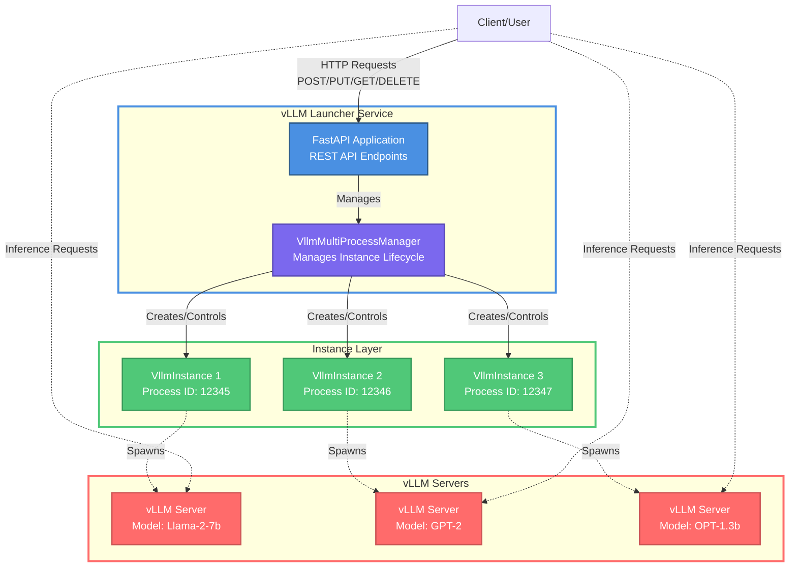

# Multi-Instance vLLM Launcher Documentation

## Overview

The Multi-Instance vLLM Launcher (a.k.a. the launcher) is a Python program that implements a REST API service that allows clients to dynamically create, manage, and delete vLLM inference server instances. The goal is to achieve model swapping functionality without changes to vLLM. This enables flexible model serving where clients can spin up different models on demand, and support concurrent inference workloads.

The launcher preloads vLLM’s Python modules to accelerate the initialization of multiple instances. Each vLLM process launched is therefore a subprocess of the launcher.

## Table of Contents

- [Features](#features)
- [Architecture](#architecture)
- [Installation](#installation)
- [Build Image](#build-image)
- [Quick Start](#quick-start)
- [API Reference](#api-reference)
- [Usage Examples](#usage-examples)
- [Configuration](#configuration)
- [Key Classes](#key-classes)
- [Best Practices](#best-practices)

## Features

- **Multiple Instance Management**: Run multiple vLLM instances simultaneously with unique identifiers
- **Dynamic Creation/Deletion**: Create and delete instances on demand via REST API
- **Auto & Custom IDs**: Support for both auto-generated UUIDs and custom instance IDs
- **Process Isolation**: Each vLLM instance runs in a separate process with isolated configuration
- **Environment Variable Support**: Set custom environment variables per instance
- **Graceful Shutdown**: Proper termination with configurable timeout and force-kill fallback
- **Status Monitoring**: Query status of individual instances or all instances at once
- **Log Capture**: Retrieve stdout/stderr logs from running instances via REST API
- **Health Checks**: Built-in health endpoint for monitoring service availability

> [!NOTE]
> This is still not implemeted, but the client controls the subset of the node's GPUs that get used by a given vLLM instance.

## Architecture



## Installation

### Prerequisites

- Python 3.12.10+
- vLLM and its dependencies
- FastAPI and dependencies
- uvicorn (ASGI server)
- uvloop (event loop)

### Install Dependencies

```bash
pip install vllm
pip install -r inference_server/launcher/requirements.txt
```

### Install the Launcher

```bash
# Clone or copy the launcher.py file
# No additional installation needed
```

## Build Image

An image containining vLLM and the launcher.py can be built.
Build and push it (use your favorate
`CONTAINER_IMG_REG`) with a command like the following:

```shell
make build-launcher CONTAINER_IMG_REG=$CONTAINER_IMG_REG
make push-launcher  CONTAINER_IMG_REG=$CONTAINER_IMG_REG
```

or for building and pushing at the same time:

```shell
make build-and-push-launcher CONTAINER_IMG_REG=$CONTAINER_IMG_REG
```

## Quick Start

### 1. Start the Launcher Service

```bash
python launcher.py
```

The service will start on `http://0.0.0.0:8001`

### 2. Create Your First Instance

```bash
curl -X POST http://localhost:8001/v2/vllm/instances \
  -H "Content-Type: application/json" \
  -d '{
    "options": "--model facebook/opt-125m --port 8000"
  }'
```

Response:

```json
{
  "status": "started",
  "instance_id": "a1b2c3d4-e5f6-7890-abcd-ef1234567890",
}
```

### 3. Check Instance Status

```bash
curl -X GET http://localhost:8001/v2/vllm/instances/a1b2c3d4-e5f6-7890-abcd-ef1234567890
```

### 4. Use the vLLM Instance

Once started, the vLLM instance is accessible at its configured port (e.g., `http://localhost:8000`):

```bash
curl http://localhost:8000/v2/chat/completions \
  -H "Content-Type: application/json" \
  -d '{
    "model": "facebook/opt-125m",
    "messages": [
      {"role": "system", "content": "You are a helpful assistant."},
      {"role": "user", "content": "Tell me a joke about AI."}
    ],
    "temperature": 0.7,
    "max_tokens": 100
  }'
```

### 5. Delete the Instance

```bash
curl -X DELETE http://localhost:8001/v2/vllm/instances/a1b2c3d4-e5f6-7890-abcd-ef1234567890
```

## API Reference

### Endpoints

#### Service Information

**GET** `/`

Get service information and available endpoints.

**Response:**

```json
{
  "name": "Multi-Instance vLLM Management API",
  "version": "2.0",
  "endpoints": {
    "index": "GET /",
    "health": "GET /health",
    "create_instance": "POST /v2/vllm/instances",
    "create_named_instance": "PUT /v2/vllm/instances/{instance_id}",
    "delete_instance": "DELETE /v2/vllm/instances/{instance_id}",
    "delete_all_instances": "DELETE /v2/vllm/instances",
    "get_instance_status": "GET /v2/vllm/instances/{instance_id}",
    "get_all_instances": "GET /v2/vllm/instances",
    "get_instance_logs": "GET /v2/vllm/instances/{instance_id}/log"
  }
}
```

---

#### Health Check

**GET** `/health`

Check if the launcher service is running.

**Response:**

```json
{
  "status": "OK"
}
```

---

#### Create Instance (Auto-Generated ID)

**POST** `/v2/vllm/instances`

Create a new vLLM instance with an auto-generated UUID.

**Request Body:**

```json
{
  "options": "--model MODEL_NAME --port PORT",
  "env_vars": {
    "VAR_NAME": "value"
  }
}
```

**Parameters:**

- `options` (required): Command-line options for vLLM
- `env_vars` (optional): Dictionary of environment variables

**Response (201 Created):**

```json
{
  "status": "started",
  "instance_id": "uuid-string",
}
```

**Error Responses:**

- `500 Internal Server Error`: Failed to create instance

---

#### Create Instance (Custom ID)

**PUT** `/v2/vllm/instances/{instance_id}`

Create a new vLLM instance with a custom instance ID.

**Path Parameters:**

- `instance_id`: Custom identifier for the instance

**Request Body:** Same as auto-generated ID endpoint

**Response (201 Created):** Same as auto-generated ID endpoint

**Error Responses:**

- `409 Conflict`: Instance with this ID already exists.
- `500 Internal Server Error`: Failed to create instance

---

#### Delete Instance

**DELETE** `/v2/vllm/instances/{instance_id}`

Stop and delete a specific vLLM instance.

**Path Parameters:**

- `instance_id`: ID of the instance to delete

**Response (200 OK):**

```json
{
  "status": "terminated",
  "instance_id": "instance-id",
}
```

**Error Responses:**

- `404 Not Found`: Instance not found

---

#### Get Instance Logs

**GET** `/v2/vllm/instances/{instance_id}/log`

Retrieve stdout/stderr logs from a specific vLLM instance as raw bytes.

**Path Parameters:**

- `instance_id`: ID of the instance

**Request Headers:**

- `Range` (optional): Byte range to retrieve, following [RFC 9110](https://www.rfc-editor.org/rfc/rfc9110#field.range). Supported formats:
  - `Range: bytes=START-END` — retrieve bytes from START to END (both inclusive)
  - `Range: bytes=START-` — retrieve bytes from START to end of log (up to 1 MB)
  - Suffix ranges (`bytes=-N`) are **not** supported.

**Response (200 OK) — without Range header:**

Returns the full log content (up to 1 MB) as `application/octet-stream`.

**Response (206 Partial Content) — with Range header:**

Returns the requested byte range as `application/octet-stream` with a `Content-Range` header:

```
Content-Range: bytes START-END/TOTAL
Content-Type: application/octet-stream
```

**Error Responses:**

- `400 Bad Request`: Malformed or unsupported Range header
- `404 Not Found`: Instance not found
- `416 Range Not Satisfiable`: The requested start position is beyond available log content. The response includes a `Content-Range: bytes */N` header (per [RFC 9110 §15.5.17](https://www.rfc-editor.org/rfc/rfc9110#status.416)) with an empty body, where `N` is the total number of bytes captured so far.

---

#### Delete All Instances

**DELETE** `/v2/vllm/instances`

Stop and delete all running vLLM instances. This functionality can be specially useful for testing purposes.

**Response (200 OK):**

```json
{
  "status": "all_stopped",
  "stopped_instances": [
    {"status": "terminated", "instance_id": "id-1"},
    {"status": "terminated", "instance_id": "id-2"}
  ],
  "total_stopped": 2
}
```

---

#### List Instance IDs

**GET** `/v2/vllm/instances?detail=False`

List all instance IDs currently managed by the launcher.

**Response (200 OK):**

```json
{
  "instance_ids": ["id-1", "id-2", "id-3"],
  "count": 3
}
```

---

#### List Instances Status with details

**GET** `/v2/vllm/instances?detail=True`

Get status information for all instances. `Detail` is `True` by default.

**Response (200 OK):**

```json
{
  "total_instances": 3,
  "running_instances": 2,
  "instances": [
    {
      "status": "running",
      "instance_id": "id-1",
    },
    {
      "status": "stopped",
      "instance_id": "id-2",
    },
    {
      "status": "running",
      "instance_id": "id-3",
    }
  ]
}
```

**Possible Status Values:**

- `running`: Instance is currently running
- `stopped`: Instance process has stopped

---

#### Get Single Instance Status

**GET** `/v2/vllm/instances/{instance_id}`

Get status information for a specific instance.

**Path Parameters:**

- `instance_id`: ID of the instance

**Response (200 OK):**

```json
{
  "status": "running",
  "instance_id": "instance-id",
}
```

**Possible Status Values:**

- `running`: Instance is currently running
- `stopped`: Instance process has stopped

**Error Responses:**

- `404 Not Found`: Instance not found

## Usage Examples

### Example 1: Basic Single Instance

```bash
# Create instance
curl -X POST http://localhost:8001/v2/vllm/instances \
  -H "Content-Type: application/json" \
  -d '{
    "options": "--model facebook/opt-125m --port 8000"
  }'

# Use the instance (vLLM API)
curl http://localhost:8000/v2/models

# Delete instance
curl -X DELETE http://localhost:8001/v2/vllm/instances/abc123...
```

### Example 2: Multiple Models on Different Ports

```bash
# Start Llama 2 on port 8010
curl -X PUT http://localhost:8001/v2/vllm/instances/llama2 \
  -H "Content-Type: application/json" \
  -d '{
    "options": "--model meta-llama/Llama-2-7b-hf --port 8010"
  }'

# Start GPT-2 on port 8011
curl -X PUT http://localhost:8001/v2/vllm/instances/gpt2 \
  -H "Content-Type: application/json" \
  -d '{
    "options": "--model gpt2 --port 8011"
  }'

# Start OPT on port 8012
curl -X PUT http://localhost:8001/v2/vllm/instances/opt \
  -H "Content-Type: application/json" \
  -d '{
    "options": "--model facebook/opt-1.3b --port 8012"
  }'

# List all instances
curl http://localhost:8001/v2/vllm/instances
```

### Example 3: Using Environment Variables

```bash
curl -X POST http://localhost:8001/v2/vllm/instances \
  -H "Content-Type: application/json" \
  -d '{
    "options": "--model meta-llama/Llama-2-7b-hf --port 8000 --tensor-parallel-size 2",
    "env_vars": {
      "CUDA_VISIBLE_DEVICES": "0,1",
      "VLLM_ATTENTION_BACKEND": "FLASHINFER",
      "MAX_BATCH_SIZE": "128"
    }
  }'
```

### Example 4: List Status of All Instances

```bash
# Get detailed status
curl http://localhost:8001/v2/vllm/instances
```

### Example 5: Retrieve Instance Logs

```bash
# Get up to 1 MB of logs from the beginning (no Range header → 200 OK)
curl http://localhost:8001/v2/vllm/instances/abc123.../log

# Get the first 1 MB chunk (Range header → 206 Partial Content)
curl -H "Range: bytes=0-1048575" \
  http://localhost:8001/v2/vllm/instances/abc123.../log

# Second chunk — continue from byte 1048576
curl -H "Range: bytes=1048576-2097151" \
  http://localhost:8001/v2/vllm/instances/abc123.../log

# Open-ended range — from byte 2097152 to EOF (up to 1 MB)
curl -H "Range: bytes=2097152-" \
  http://localhost:8001/v2/vllm/instances/abc123.../log
```

**How the Range header works:**

The log is treated as a flat byte stream. The `Range` header specifies which bytes to retrieve:

```
Example: 30 bytes of log content

No Range header        → 200 OK, returns bytes [0, 30)
Range: bytes=0-14      → 206, returns bytes [0, 15)
Range: bytes=15-29     → 206, returns bytes [15, 30)
Range: bytes=15-       → 206, returns bytes [15, 30) (open-ended)
```

The `Content-Range` response header tells you exactly which bytes were returned and the total file size, e.g. `Content-Range: bytes 0-1048575/5242880`.

## Configuration

### vLLM Options

The `options` field contains stuff added to the command line of the launched `vllm serve`. Options are listed below.

#### Required Options

- `--model MODEL_NAME`: HuggingFace model ID or local path
- `--port PORT`: Port for the vLLM OpenAI-compatible API server

### Environment Variables

You can set environment variables for each instance, useful for:

- GPU selection: `CUDA_VISIBLE_DEVICES`
- vLLM-specific: `VLLM_*` environment variables

### Launcher Configuration

The launcher itself can be configured by modifying the `__main__` block:

```python
if __name__ == "__main__":
    import uvicorn

    uvicorn.run(
        app,
        host="0.0.0.0",      # Listen address
        port=8001,            # Launcher API port
        log_level="info"      # Logging level
    )
```

or passing the parameters on the command line:

```bash
uvicorn --port 8001 --log-level info launcher:app
```

## Key Classes

### `VllmConfig`

Pydantic model (data class) defining the configuration for a vLLM instance.

**Attributes:**

- `options` (str): Command-line options passed to vLLM (e.g., `"--model meta-llama/Llama-2-7b --port 8000"`)
- `env_vars` (Optional[Dict[str, Any]]): Environment variables to set for the vLLM process

Ex:

```yaml
{
  "options": "--model TinyLlama/TinyLlama-1.1B-Chat-v1.0 --port 8005",
  "env_vars": {
    "VLLM_USE_V1": "1",
    "VLLM_LOGGING_LEVEL": "DEBUG"
  }
}
```

### `VllmInstance`

Represents a single vLLM instance with its process and configuration.

**Key Methods:**

- `start()`: Start the vLLM process
- `stop(timeout=10)`: Stop the vLLM process gracefully (or force kill after timeout)
- `get_status()`: Get detailed status information
- `get_log_bytes(start=0, end=None)`: Retrieve log bytes from the instance, returns `(bytes, total_size)`

#### `VllmMultiProcessManager`

Manages multiple VllmInstance objects.

**Key Methods:**

- `create_instance(vllm_config, instance_id=None)`: Create and start a new instance
- `stop_instance(instance_id, timeout=10)`: Stop a specific instance
- `stop_all_instances(timeout=10)`: Stop all running instances
- `get_instance_status(instance_id)`: Get status of a specific instance
- `get_all_instances_status()`: Get status of all instances
- `get_instance_log_bytes(instance_id, start=0, end=None)`: Retrieve log bytes from a specific instance, returns `(bytes, total_size)`

## Best Practices

### 1. Port Management

Each vLLM instance needs a unique port. Plan your port allocation:

```bash
# Good: Different ports
Instance 1: --port 8000
Instance 2: --port 8001
Instance 3: --port 8002

# Bad: Same port (will fail)
Instance 1: --port 8000
Instance 2: --port 8000  # ❌ Port conflict!
```

### 2. Graceful Shutdown

Always delete instances when done to free resources:

```bash
# Delete specific instance
curl -X DELETE http://localhost:8001/v2/vllm/instances/instance-id

# Or clean up all instances
curl -X DELETE http://localhost:8001/v2/vllm/instances
```

### 3. Error Handling

Always check response status codes:

```python
response = requests.put(url, json=config)
if response.status_code == 201:
    print("Success:", response.json())
elif response.status_code == 409:
    print("Instance already exists")
elif response.status_code == 500:
    print("Failed to create vLLM instance:", response.json()["detail"])
```

### 4. Resource Limits

Be mindful of system resources:

- **Memory**: Each instance loads a full model into memory
- **GPU**: Plan GPU allocation carefully
- **CPU**: vLLM uses CPU for pre/post-processing
- **Disk**: Models are cached in the container's filesystem

### 5. Log Management

The launcher captures stdout/stderr from each vLLM instance by writing directly to a log file on disk:

- **Architecture**: A `FileWriter` in the child process appends output to a per-instance log file (`/tmp/launcher-<pid>-vllm-<instance_id>.log`). Two `FileWriter` instances (stdout + stderr) safely share the same file via POSIX `O_APPEND` semantics. Each write is followed by a flush so the parent can read new content immediately.
- **Raw Bytes**: The log endpoint returns `application/octet-stream` — raw bytes, not JSON.
- **Range Header**: Use the standard HTTP `Range: bytes=START-END` header to request specific byte ranges. Without a Range header, the full log (up to 1 MB) is returned.
- **No Data Loss**: Since logs are written directly to disk, there is no bounded queue that could overflow and drop messages.
- **Non-blocking**: Log capture doesn't slow down the vLLM process.
- **Streaming Support**: Use the `Content-Range` response header to track position for efficient streaming.
- **Cleanup**: Log files are automatically removed when an instance is stopped or deleted.

**Best Practices:**

- **Streaming Logs**: Use the Range header to stream logs efficiently. The `Content-Range` response header tells you the byte range and total size:

  ```python
  # Python example
  import requests

  start = 0
  while True:
      resp = requests.get(
          f"http://localhost:8001/v2/vllm/instances/id/log",
          headers={"Range": f"bytes={start}-"},
      )
      if resp.status_code == 416:
          break  # No new content
      data = resp.content
      if not data:
          break
      start += len(data)
  ```

- **Polling**: Track `start + len(response.content)` between requests to only fetch new content
- **Data Loss**: Logs are lost when an instance is deleted (the log file is removed)
- **Production**: Consider external logging solutions for long-term storage and analysis

### 6. Testing

Test with small models first:

```bash
# Use small models for testing
--model facebook/opt-125m      # ~250MB
--model gpt2                   # ~500MB

# Then move to production models
--model meta-llama/Llama-2-7b-hf   # ~14GB
--model meta-llama/Llama-2-13b-hf  # ~26GB
```

---
