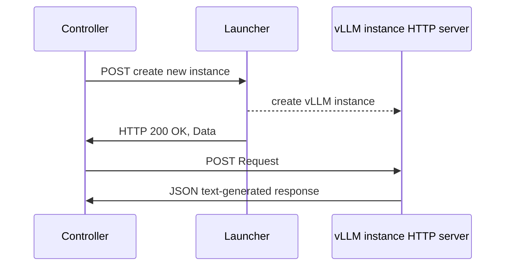
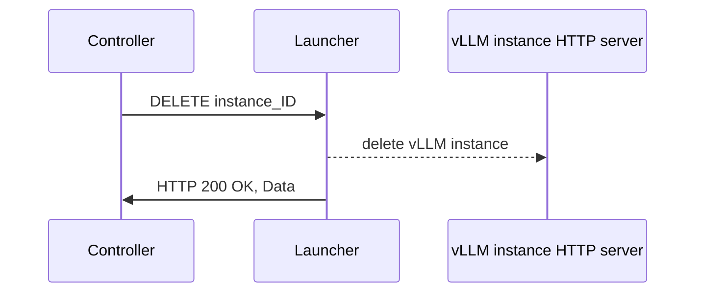
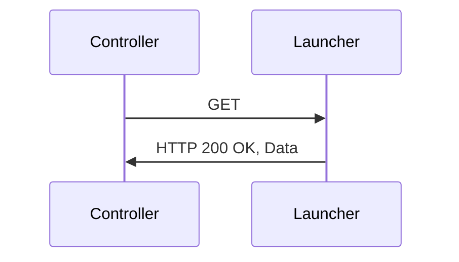

# vLLM Launcher

## Description

This document describes a vLLM launcher that can be used to achieve model swapping without changes to vLLM. The launcher initializes and manages various subsidiary inference vLLM servers and keeps the ID and the model (in addition to other information like the type of accelerator and the GPU number). The launcher does basic vLLM code loading and initialization work (like import modules) of the inference server so that this work does not have to be done at the startup of the inference server process, reducing the startup latency. In future work, the launcher could be extended to sleep and wake up the inference servers that have been initialize by its POST method, and support mutiple instances.

## Launcher Methods and functionalities

The client/user will use a launcher-specific command to run the launcher. To swap a model in, the controller will issue a POST request (to the launcher) that includes the model reference and the model-specific flags.

Setting up process to create a new vLLM inference instance using POST:



An example of a CURL command that could be sent to the launcher can be seen below:

```bash
curl -X POST \
  -H "Content-Type: application/json" \
  -d 'JSON_EXAMPLE' \
  http://localhost:8000/vllm
```

where the `JSON_EXAMPLE` is:

```json
{
    "common_vllm_flags":{
        "str_common_flag": "text",
        "int_common_flag": 1000
    },
    "model": "meta-llama/Llama-3.1-8B-Instruct",
    "model_specific_flags": {
        "bool_specific_flag": true,
        "str_specific_flag": "text"
    }

}
```

To swap a model out, the controller will issue a request that does not include the model reference nor the model-specific flags, but it will include an ID to identify the inference instance to be deleted.

Deleting process of a vLLM inference instance using DELETE:



Following the same example that we used for POST, a DELETE CURL command could be:

```bash
curl -X DELETE \
  -H "Content-Type: application/json" \
  -d '{"instance_ID": "0EFA"}' \
  http://localhost:8000/vllm
```

Finally, the controller will fetch the inference ID, the models, and the accelerator using a GET method. The launcher will keep track of the instance ID and model. The information will be sent to the controller:



JSON reply example:

```json
{
    "instance_ID": "0EFA",
    "model": "facebook/opt-125m",
    "GPU": 3
}
```
