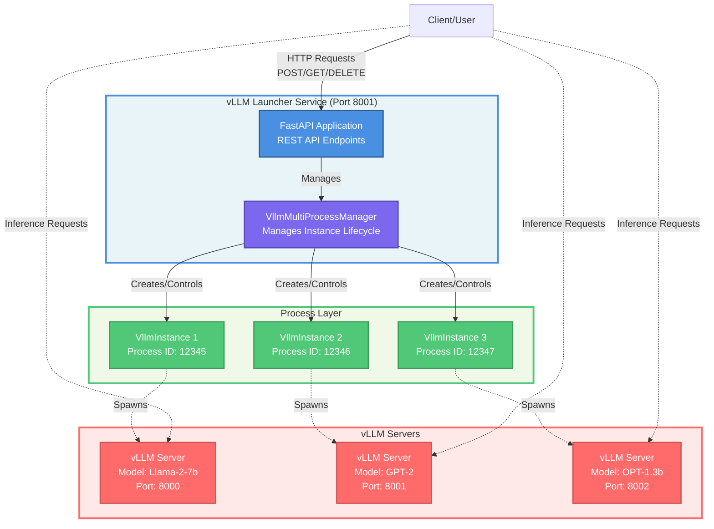

# Multi-Instance vLLM Launcher Documentation

## Overview

The Multi-Instance vLLM Launcher is a REST API service that allows you to dynamically create, manage, and terminate multiple vLLM inference server instances to achieve model swapping functionality under the Fast Model Actuation (FMA) project. This enables flexible model serving where you can spin up different models on demand, and support multiple concurrent inference workloads.

## Table of Contents

- [Features](#features)
- [Architecture](#architecture)
- [Installation](#installation)
- [Quick Start](#quick-start)
- [API Reference](#api-reference)
- [Usage Examples](#usage-examples)
- [Configuration](#configuration)
- [Best Practices](#best-practices)

## Features

- **Multiple Instance Management**: Run multiple vLLM instances simultaneously with unique identifiers
- **Dynamic Creation/Deletion**: Start and stop instances on demand via REST API
- **Auto & Custom IDs**: Support for both auto-generated UUIDs and custom instance IDs
- **Process Isolation**: Each vLLM instance runs in a separate process with isolated configuration
- **Environment Variable Support**: Set custom environment variables per instance
- **Graceful Shutdown**: Proper termination with configurable timeout and force-kill fallback
- **Status Monitoring**: Query status of individual instances or all instances at once
- **Health Checks**: Built-in health endpoint for monitoring service availability

## Architecture

### Components



### Key Classes

#### `VllmConfig`

Pydantic model (data class) defining the configuration for a vLLM instance.

**Attributes:**

- `options` (str): Command-line options passed to vLLM (e.g., `"--model meta-llama/Llama-2-7b --port 8000"`)
- `env_vars` (Optional[Dict[str, Any]]): Environment variables to set for the vLLM process

Ex:

```yaml
{
  "options": "--model TinyLlama/TinyLlama-1.1B-Chat-v1.0 --port 8005",
  "env_vars": {
    "VLLM_USE_V1": "1",
    "VLLM_LOGGING_LEVEL": "DEBUG"
  }
}
```

#### `VllmInstance`

Represents a single vLLM instance with its process and configuration.

**Key Methods:**

- `start()`: Start the vLLM process
- `stop(timeout=10)`: Stop the vLLM process gracefully (or force kill after timeout)
- `is_running()`: Check if the process is currently running
- `get_status()`: Get detailed status information

#### `VllmMultiProcessManager`

Manages multiple VllmInstance objects.

**Key Methods:**

- `create_instance(vllm_config, instance_id=None)`: Create and start a new instance
- `stop_instance(instance_id, timeout=10)`: Stop a specific instance
- `stop_all_instances(timeout=10)`: Stop all running instances
- `get_instance_status(instance_id)`: Get status of a specific instance
- `get_all_instances_status()`: Get status of all instances
- `list_instances()`: List all instance IDs

## Installation

### Prerequisites

- Python 3.12.10+
- vLLM library installed
- FastAPI and dependencies
- uvicorn (ASGI server)
- uvloop (event loop)

### Install Dependencies

```bash
pip install vllm
pip install -r inference_server/launcher/requirements.txt
```

### Install the Launcher

```bash
# Clone or copy the launcher.py file
# No additional installation needed
```

## Quick Start

### 1. Start the Launcher Service

```bash
python vllm_launcher.py
```

The service will start on `http://0.0.0.0:8001`

### 2. Create Your First Instance

```bash
curl -X PUT http://localhost:8001/v2/vllm \
  -H "Content-Type: application/json" \
  -d '{
    "options": "--model facebook/opt-125m --port 8000"
  }'
```

Response:

```json
{
  "status": "started",
  "instance_id": "a1b2c3d4-e5f6-7890-abcd-ef1234567890",
  "pid": 12345
}
```

### 3. Check Instance Status

```bash
curl -X GET http://localhost:8001/v2/vllm/a1b2c3d4-e5f6-7890-abcd-ef1234567890
```

### 4. Use the vLLM Instance

Once started, the vLLM instance is accessible at its configured port (e.g., `http://localhost:8000`):

```bash
curl http://localhost:8000/v2/chat/completions \
  -H "Content-Type: application/json" \
  -d '{
    "model": "facebook/opt-125m",
    "messages": [
      {"role": "system", "content": "You are a helpful assistant."},
      {"role": "user", "content": "Tell me a joke about AI."}
    ],
    "temperature": 0.7,
    "max_tokens": 100
  }'
```

### 5. Delete the Instance

```bash
curl -X DELETE http://localhost:8001/v2/vllm/a1b2c3d4-e5f6-7890-abcd-ef1234567890
```

## API Reference

### Base URL

```
http://localhost:8001
```

### Endpoints

#### Health Check

**GET** `/health`

Check if the launcher service is running.

**Response:**

```json
{
  "status": "OK"
}
```

---

#### Service Information

**GET** `/`

Get service information and available endpoints.

**Response:**

```json
{
  "name": "Multi-Instance vLLM Management API",
  "version": "2.0",
  "endpoints": {
    "create_instance": "PUT /v2/vllm",
    "create_named_instance": "PUT /v2/vllm/{instance_id}",
    "delete_instance": "DELETE /v2/vllm/{instance_id}",
    "delete_all_instances": "DELETE /v2/vllm",
    "get_instance_status": "GET /v2/vllm/{instance_id}",
    "get_all_instances": "GET /v2/vllm",
    "list_instances": "GET /v2/vllm/instances"
  }
}
```

---

#### Create Instance (Auto-Generated ID)

**POST** `/v2/vllm`

Create a new vLLM instance with an auto-generated UUID.

**Request Body:**

```json
{
  "options": "--model MODEL_NAME --port PORT",
  "env_vars": {
    "VAR_NAME": "value"
  }
}
```

**Parameters:**

- `options` (required): Command-line options for vLLM
- `env_vars` (optional): Dictionary of environment variables

**Response (201 Created):**

```json
{
  "status": "started",
  "instance_id": "uuid-string",
  "pid": 12345
}
```

**Error Responses:**

- `500 Internal Server Error`: Failed to create instance

---

#### Create Instance (Custom ID)

**PUT** `/v2/vllm/{instance_id}`

Create a new vLLM instance with a custom instance ID.

**Path Parameters:**

- `instance_id`: Custom identifier for the instance

**Request Body:** Same as auto-generated ID endpoint

**Response (201 Created):** Same as auto-generated ID endpoint

**Error Responses:**

- `409 Conflict`: Instance with this ID already exists
- `500 Internal Server Error`: Failed to create instance

---

#### Delete Instance

**DELETE** `/v2/vllm/{instance_id}`

Stop and delete a specific vLLM instance.

**Path Parameters:**

- `instance_id`: ID of the instance to delete

**Response (200 OK):**

```json
{
  "status": "terminated",
  "instance_id": "instance-id",
  "pid": 12345
}
```

**Error Responses:**

- `404 Not Found`: Instance not found

---

#### Delete All Instances

**DELETE** `/v2/vllm`

Stop and delete all running vLLM instances.

**Response (200 OK):**

```json
{
  "status": "all_stopped",
  "stopped_instances": [
    {"status": "terminated", "instance_id": "id-1", "pid": 12345},
    {"status": "terminated", "instance_id": "id-2", "pid": 12346}
  ],
  "total_stopped": 2
}
```

---

#### List Instance IDs

**GET** `/v2/vllm/instances`

List all instance IDs currently managed by the launcher.

**Response (200 OK):**

```json
{
  "instance_ids": ["id-1", "id-2", "id-3"],
  "count": 3
}
```

---

#### Get All Instances Status

**GET** `/v2/vllm`

Get status information for all instances.

**Response (200 OK):**

```json
{
  "total_instances": 3,
  "running_instances": 2,
  "instances": [
    {
      "status": "running",
      "instance_id": "id-1",
      "pid": 12345
    },
    {
      "status": "stopped",
      "instance_id": "id-2",
      "pid": 12346
    },
    {
      "status": "running",
      "instance_id": "id-3",
      "pid": 12347
    }
  ]
}
```

---

#### Get Instance Status

**GET** `/v2/vllm/{instance_id}`

Get status information for a specific instance.

**Path Parameters:**

- `instance_id`: ID of the instance

**Response (200 OK):**

```json
{
  "status": "running",
  "instance_id": "instance-id",
  "pid": 12345
}
```

**Possible Status Values:**

- `not_started`: Instance created but not started
- `running`: Instance is currently running
- `stopped`: Instance process has stopped

**Error Responses:**

- `404 Not Found`: Instance not found

## Usage Examples

### Example 1: Basic Single Instance

```bash
# Create instance
curl -X PUT http://localhost:8001/v2/vllm \
  -H "Content-Type: application/json" \
  -d '{
    "options": "--model facebook/opt-125m --port 8000"
  }'

# Response: {"status": "started", "instance_id": "abc123...", "pid": 12345}

# Use the instance (vLLM API)
curl http://localhost:8000/v2/models

# Delete instance
curl -X DELETE http://localhost:8001/v2/vllm/abc123...
```

### Example 2: Multiple Models on Different Ports

```bash
# Start Llama 2 on port 8000
curl -X PUT http://localhost:8001/v2/vllm/llama2 \
  -H "Content-Type: application/json" \
  -d '{
    "options": "--model meta-llama/Llama-2-7b-hf --port 8000"
  }'

# Start GPT-2 on port 8001
curl -X PUT http://localhost:8001/v2/vllm/gpt2 \
  -H "Content-Type: application/json" \
  -d '{
    "options": "--model gpt2 --port 8001"
  }'

# Start OPT on port 8002
curl -X PUT http://localhost:8001/v2/vllm/opt \
  -H "Content-Type: application/json" \
  -d '{
    "options": "--model facebook/opt-1.3b --port 8002"
  }'

# List all instances
curl http://localhost:8001/v2/vllm/instances
```

### Example 3: Using Environment Variables

```bash
curl -X PUT http://localhost:8001/v2/vllm \
  -H "Content-Type: application/json" \
  -d '{
    "options": "--model meta-llama/Llama-2-7b-hf --port 8000 --tensor-parallel-size 2",
    "env_vars": {
      "CUDA_VISIBLE_DEVICES": "0,1",
      "VLLM_ATTENTION_BACKEND": "FLASHINFER",
      "MAX_BATCH_SIZE": "128"
    }
  }'
```

### Example 4: Check All Running Instances

```bash
# Get detailed status
curl http://localhost:8001/v2/vllm

# Response:
# {
#   "total_instances": 3,
#   "running_instances": 2,
#   "instances": [...]
# }
```

## Configuration

### vLLM Options

The `options` field accepts any valid vLLM command-line arguments. Common options include:

#### Required Options

- `--model MODEL_NAME`: HuggingFace model ID or local path
- `--port PORT`: Port for the vLLM OpenAI-compatible API server

### Environment Variables

You can set environment variables for each instance, useful for:

- GPU selection: `CUDA_VISIBLE_DEVICES`
- vLLM-specific: `VLLM_*` environment variables

### Launcher Configuration

The launcher itself can be configured by modifying the `__main__` block:

```python
if __name__ == "__main__":
    import uvicorn

    uvicorn.run(
        app,
        host="0.0.0.0",      # Listen address
        port=8001,            # Launcher API port
        log_level="info"      # Logging level
    )
```

or passing the parameters on the command line:

```bash
uvicorn --port 8001 --log-level info launcher:app
```

## Best Practices

### 1. Port Management

Each vLLM instance needs a unique port. Plan your port allocation:

```bash
# Good: Different ports
Instance 1: --port 8000
Instance 2: --port 8001
Instance 3: --port 8002

# Bad: Same port (will fail)
Instance 1: --port 8000
Instance 2: --port 8000  # ❌ Port conflict!
```

### 2. Instance Naming

Use descriptive custom IDs for easier management:

```bash
# Good
PUT /v2/vllm/llama2-7b-chat
PUT /v2/vllm/gpt2-small-production
PUT /v2/vllm/opt-testing

# Less clear
PUT /v2/vllm  # Auto-generates UUID
```

### 3. Graceful Shutdown

Always delete instances when done to free resources:

```bash
# Delete specific instance
curl -X DELETE http://localhost:8001/v2/vllm/instance-id

# Or clean up all instances
curl -X DELETE http://localhost:8001/v2/vllm
```

### 4. Error Handling

Always check response status codes:

```python
response = requests.put(url, json=config)
if response.status_code == 201:
    print("Success:", response.json())
elif response.status_code == 409:
    print("Instance already exists")
elif response.status_code == 500:
    print("Failed to create vLLM instance:", response.json()["detail"])
```

### 5. Resource Limits

Be mindful of system resources:

- **Memory**: Each instance loads a full model into memory
- **GPU**: Plan GPU allocation carefully
- **CPU**: vLLM uses CPU for pre/post-processing
- **Disk**: Models are cached in `~/.cache/huggingface`

### 6. Testing

Test with small models first:

```bash
# Use small models for testing
--model facebook/opt-125m      # ~250MB
--model gpt2                   # ~500MB

# Then move to production models
--model meta-llama/Llama-2-7b-hf   # ~14GB
--model meta-llama/Llama-2-13b-hf  # ~26GB
```

---

**Version:** 2.0
**Last Updated:** 2025
