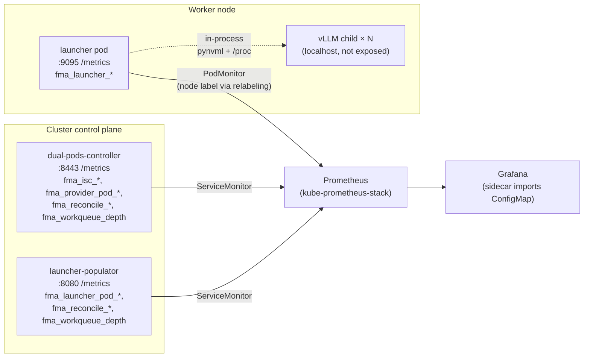
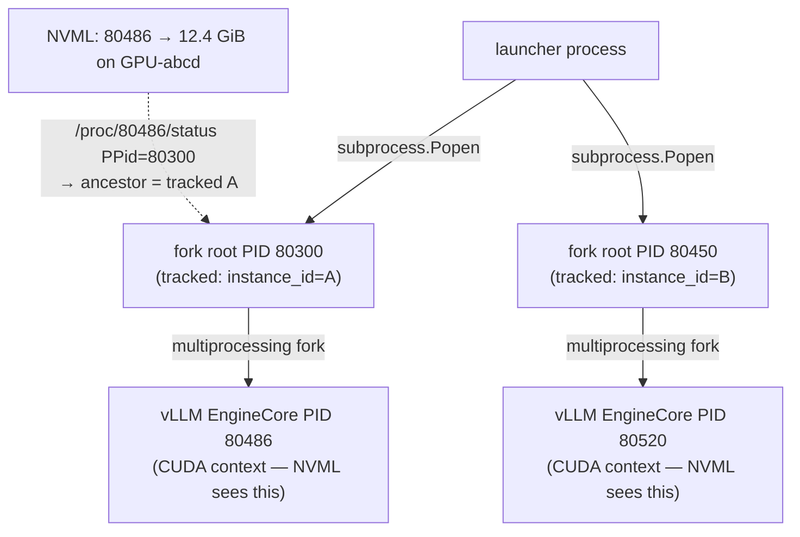

# Proposal: Resource Usage Observability for FMA

| Field | Value |
|---|---|
| **Status** | Draft |
| **Tracking issue** | [#385](https://github.com/llm-d-incubation/llm-d-fast-model-actuation/issues/385) |
| **Last updated** | 2026-05-31 |

## 1. Summary

This proposal adds first-class Prometheus observability to FMA. It introduces
three families of metrics — one per component plane (`dual-pods-controller`,
`launcher-populator`, `launcher`) — surfaced through standard Prometheus
Operator `ServiceMonitor` / `PodMonitor` CRs and visualized through a single
self-contained Grafana dashboard. 

## 2. Motivation

Issue #385 captures the same user story repeated from several angles: cluster
operators and platform engineers cannot currently answer basic questions about
an FMA deployment without `kubectl exec` into individual pods. Concretely,
none of these queries have a working answer today:

- *"How much GPU memory is each vLLM instance using right now?"*
- *"Which launcher pod's instances are sleeping vs. running?"*
- *"Is the dual-pods reconciler healthy — what's its error rate?"*

Upstream exporters do not close this gap. `dcgm-exporter` reports GPU usage by
PID and UUID, but knows nothing about FMA's `InferenceServerConfig` (ISC),
`LauncherConfig` (LCfg), or per-instance identity. `kube-state-metrics`
reports Pod/Deployment state but is opaque to FMA's `running` / `sleeping`
distinction. The metrics this proposal introduces fill the FMA-specific gap
*on top of* whatever upstream exporters the operator chooses to deploy.

## 3. Goals and non-goals

### Goals

1. Expose Prometheus metrics from every FMA component so resource usage is
   observable at four levels: per vLLM instance, per launcher pod, per node,
   and cluster-wide.
2. Ship Prometheus Operator `ServiceMonitor` / `PodMonitor` CRs so
   kube-prometheus-stack environments work zero-touch.
3. Ship a self-contained Grafana dashboard that is useful **without**
   `dcgm-exporter` being installed.
4. Keep the existing controller architecture untouched.
5. Stay neutral on environments without Prometheus Operator: `helm install`
   must succeed even when monitoring CRDs are absent.

### Non-goals

- Replacing `dcgm-exporter` where it is already deployed; the two coexist.
- Replacing vLLM's own `vllm:*` metrics (a possible federation path is sketched in §6 as an open question).
- Alerting / `PrometheusRule` CRs.
- Cluster-wide capacity planning.

## 4. Architecture overview

Three metric sources, two scrape mechanisms, one dashboard delivery channel:



Key choices:

- **Controllers stay hand-rolled.** Each spawns one extra goroutine running
  `promhttp.HandlerFor(customRegistry)` on its own port. No
  `controller-runtime` Manager is introduced.
- **Launcher exposes `/metrics` on a dedicated port** so metrics scraping
  cannot starve API throughput, and FastAPI API middleware does not affect
  scraping.
- **Each `/metrics` endpoint uses its own `prometheus.Registry`** so default
  process collectors and accidental third-party metrics never leak in.
- **`monitoring.enabled` is a single chart-level toggle, default off.** The
  `Service` resources are always rendered so operators without Prometheus
  Operator can still `kubectl port-forward` to verify `/metrics` manually.

## 5. Design

### 5.1 Three observability planes

| Plane | Source | What it tells you |
|---|---|---|
| **Control plane** | `dual-pods-controller`, `launcher-populator` | Reconciler health, queue depth, inventory of ISCs / launcher pods |
| **Per-instance plane** | `launcher` (`fma_launcher_instance_*`) | One vLLM instance's CPU/memory/GPU footprint and lifecycle state |
| **GPU plane** | `launcher` (`fma_launcher_gpu_*`) | GPU-wide memory and utilization, usable even when `dcgm-exporter` is absent |

The three planes share a common label vocabulary (`instance_id`, `model`,
`gpu_uuid`, `node`, `launcher_config`) so dashboards can pivot between them
without re-keying queries.

### 5.2 Metric catalog

All metric names use the `fma_` prefix. Histograms follow Prometheus
conventions (`_seconds`, `_bytes` base units; `_bucket` / `_sum` / `_count`
emitted automatically).

**`dual-pods-controller` — port 8443**

| Metric | Type | Labels | Purpose |
|---|---|---|---|
| `fma_isc_total` | gauge | `launcher_config`, `namespace` | Inventory of `InferenceServerConfig` objects bound to each `LauncherConfig`. Detects misconfigured ISCs that match no LCfg, and lets dashboards size the cluster's intended workload. |
| `fma_provider_pod_total` | gauge | `launcher_config`, `node`, `state=running\|sleeping` | Live count of provider pods by state and location. Drives the *controller-view* node panel that operators compare against the launcher's *measured* view — the divergence between the two is the primary signal observability is meant to surface. |
| `fma_reconcile_total` | counter | `controller=dual-pods`, `result=success\|error` | Reconcile error rate is the primary signal of controller health. The `result` label enables direct error-rate dashboards and SLOs without post-processing. |
| `fma_reconcile_duration_seconds` | histogram | `controller=dual-pods` | Reconcile latency distribution. Sustained P99 growth indicates pressure on the informer cache or downstream API server. |
| `fma_workqueue_depth` | gauge | `controller=dual-pods`, `queue` | Backpressure signal — a growing queue means events arrive faster than the reconciler completes. Pairs with reconcile duration to distinguish "slow reconciles" from "queue saturated." |

**`launcher-populator` — port 8080**

| Metric | Type | Labels | Purpose |
|---|---|---|---|
| `fma_launcher_pod_total` | gauge | `launcher_config`, `node`, `phase` | Actual launcher pod count per (LCfg, node) by pod phase. Surfaces stuck pods (e.g. `Pending`, `Failed`) that would otherwise need `kubectl get pod` to find. |
| `fma_launcher_pod_desired` | gauge | `launcher_config`, `node` | Desired count from `LauncherPopulationPolicy`. Compared against `fma_launcher_pod_total{phase="Running"}` to detect populator drift — the populator's whole purpose is keeping these two equal. |
| `fma_reconcile_total` | counter | `controller=launcher-populator`, `result` | Same role as in dual-pods — reconciler health. |
| `fma_reconcile_duration_seconds` | histogram | `controller=launcher-populator` | Same role as in dual-pods. |
| `fma_workqueue_depth` | gauge | `controller=launcher-populator`, `queue` | Same role as in dual-pods. |

**`launcher` — port 9095**

| Metric | Type | Labels | Purpose |
|---|---|---|---|
| `fma_launcher_instance_total` | gauge | `state=running\|sleeping\|pending\|failed` | Cheap per-pod aggregate for the cluster instance-count panel; works without label join. |
| `fma_launcher_instance_info` | gauge=1 | `instance_id`, `model`, `state` | Join target for per-instance label enrichment in dashboards (see §5.4). Lets every per-instance metric pivot by `model` or `state` without carrying those labels itself, keeping cardinality stable. |
| `fma_launcher_instance_rss_bytes` | gauge | `instance_id` | Resident memory of the vLLM process. The only externally verifiable signal that `sleep` actually offloaded weights to host RAM (see §5.5) — no other component in the system can observe this. |
| `fma_launcher_instance_gpu_memory_bytes` | gauge | `instance_id`, `gpu_uuid` | Per-instance GPU memory attribution. Answers *"how much GPU memory is instance X using on a given GPU?"* — a question that requires the launcher's `pid → instance_id` table to map NVML's PID-keyed view onto FMA-managed identities, so no upstream exporter can produce it without that join. |
| `fma_launcher_gpu_memory_used_bytes` | gauge | `gpu_uuid`, `gpu_index` | GPU-wide used memory. Lets the dashboard show GPU pressure without requiring `dcgm-exporter`. Also enables the *"GPU total − Σ per-instance attribution"* leak / unattributed-process check. |
| `fma_launcher_gpu_memory_total_bytes` | gauge | `gpu_uuid`, `gpu_index` | GPU capacity. Paired with `gpu_memory_used_bytes` for utilization-ratio panels. |
| `fma_launcher_gpu_utilization_percent` | gauge | `gpu_uuid`, `gpu_index` | GPU compute utilization. Combined with per-instance memory, helps detect *"instance holds memory but isn't computing"* patterns. |
| `fma_launcher_gpu_sample_errors_total` | counter | — | NVML transient-error counter. Lets operators distinguish *"GPU metric missing because no GPU"* from *"GPU metric missing because pynvml is failing"*. |

### 5.3 Per-instance GPU memory attribution

This section walks through how per-instance GPU memory attribution works.
The goal: answer *"how much GPU memory is `instance_id=foo` using on
`gpu_uuid=GPU-abcd`?"* — a question that no upstream exporter can answer
today, because none of them know what an FMA `instance_id` is. The design
is described here in detail because it has the most subtle implementation
gotchas in the proposal.

#### Why dcgm-exporter cannot answer it

`dcgm-exporter` exports `DCGM_FI_DEV_FB_USED` per `(Hostname, gpu, UUID)` and
process-level memory per `(pid)`, but it has no way to map a PID to an
`instance_id` — because FMA assigns `instance_id`s in the launcher, and
nothing emits that mapping to a label store dcgm-exporter can join against.
The only component that owns the mapping is the launcher itself.

#### Approach: pynvml inside the launcher

The launcher already forks every vLLM child via `subprocess.Popen`, so it
knows each child's PID and its `instance_id`. By running `pynvml` in-process
and calling `nvmlDeviceGetComputeRunningProcesses` on each GPU, the launcher
gets `(pid, used_bytes)` tuples that it can join against its own
`pid → instance_id` table and emit as
`fma_launcher_instance_gpu_memory_bytes{instance_id, gpu_uuid}`.

The same sweep also produces GPU-wide gauges (`fma_launcher_gpu_memory_*`,
`fma_launcher_gpu_utilization_percent`) so a dashboard works even on clusters
without `dcgm-exporter`.

#### Gotcha #1: container PID namespace

NVML returns **host** PIDs. The launcher's `subprocess.Popen.pid` is a
**container-view** PID. By default the two PID namespaces are isolated, the
join key never matches, and the per-instance series is silently empty even
though every other piece works.

**Resolution: opt-in `hostPID: true` on the launcher pod.** This puts the
launcher and its children in the host PID namespace, so `Popen.pid` and the
PIDs NVML reports are in the same namespace.

This is a standard pattern (node-exporter, cAdvisor, NVIDIA's
gpu-feature-discovery all use it). The alternative — walking
`/proc/<pid>/status` `NSpid` to translate between namespaces — requires the
same elevated visibility and is more fragile across kernel versions.

The cost is real but bounded: the launcher container already has
`/dev/nvidia*` access and the NVIDIA driver hook, so the incremental host
exposure from `hostPID: true` is modest. The chart exposes this as
`launcher.hostPID: false` by default; operators opt in when they want
per-instance GPU attribution.

#### Gotcha #2: fork root vs. vLLM EngineCore PID

`hostPID: true` is necessary but not sufficient. We discovered this only
during in-cluster validation:

- The launcher's `subprocess.Popen` PID is the **multiprocessing fork root**
  (e.g. `80300`). This is the entry process Python spawns.
- vLLM internally uses `multiprocessing` to spawn its `EngineCore` worker as
  a child of the fork root (e.g. `80486`). The CUDA context lives in the
  child, not the fork root.
- NVML's `nvmlDeviceGetComputeRunningProcesses` correctly reports the **child
  PID** that holds the CUDA context, not the fork root.

So the join `nvml_pid (80486) ↔ launcher_tracked_pid (80300)` misses. The
series is still empty, even with `hostPID` enabled.

**Resolution: walk `/proc/<pid>/status` PPid upward.** For every PID NVML
reports, the launcher BFS-walks the PPid chain via `/proc/<pid>/status`
(`PPid:` field) and checks whether any ancestor is one of its tracked fork
roots. If so, the GPU memory is attributed to that ancestor's `instance_id`.



The BFS is bounded (depth typically 1–2) and uses only `/proc`, so it has no
extra dependencies and works across kernel versions.

#### Trade-offs summary

| Decision | Cost | Benefit |
|---|---|---|
| pynvml in-process (vs. dcgm-exporter) | Some overlap on GPU-wide metrics where dcgm-exporter also runs | Per-instance attribution that dcgm-exporter cannot produce |
| `hostPID: true` opt-in | Elevated host PID visibility for the launcher container | Two PID namespaces collapse, NVML PIDs become joinable |
| `/proc` PPid BFS | One extra `/proc` read per GPU process per sweep | Survives the multiprocessing fork-root → EngineCore PID indirection without parsing vLLM internals |

### 5.4 Info-metric pattern for label enrichment

To keep cardinality on stable identifiers, the launcher emits a separate
constant-1 gauge whose only purpose is to carry human-readable labels:

```
fma_launcher_instance_info{instance_id="abc",model="llama-3-8b",state="running"} 1
```

Dashboards then enrich any per-instance metric at query time:

```promql
fma_launcher_instance_gpu_memory_bytes
  * on(instance_id) group_left(model, state)
  fma_launcher_instance_info
```

This pattern is borrowed from `kube_pod_info` and `node_uname_info`. The
benefit is that `model` and `state` can be added, renamed, or extended
without rewriting every existing metric's labels — only the info series
changes. The cost is one extra series per instance and a small amount of
PromQL ceremony, both negligible.

### 5.5 Process self-observation via `/proc`

`fma_launcher_instance_rss_bytes` is read directly from
`/proc/<pid>/status` (`VmRSS:` field). No `psutil` dependency is introduced.

RSS is uniquely valuable in the FMA context: it is the only externally
verifiable signal that vLLM's `sleep` has actually offloaded weights from
GPU to host RAM. The dual-pods controller cannot see this (no host-side
view); GPU exporters cannot see this (host RAM is invisible to NVML). Only
the launcher's own process-RSS gauge can close the loop.

### 5.6 Controller-side metrics

The two Go controllers expose a uniform shape:

- **`fma_reconcile_total{controller, result=success|error}`** — counter,
  incremented at every reconcile completion. `result` is the most useful
  built-in dimension: error-rate dashboards and SLOs need it.
- **`fma_reconcile_duration_seconds{controller}`** — histogram, observed at
  the same point. Default Prometheus client buckets are sufficient.
- **`fma_workqueue_depth{controller, queue}`** — gauge, current length of
  each client-go workqueue.
- **Inventory gauges** (`fma_isc_total`, `fma_provider_pod_total`, etc.) —
  snapshotted from informer caches on a periodic tick.

#### Why not `controller_runtime_reconcile_*`?

FMA's controllers are hand-rolled around client-go informers and workqueues,
not built on `sigs.k8s.io/controller-runtime`. The standard
`controller_runtime_reconcile_*` family is not emitted because the Manager
that emits it is not running. We chose to define `fma_reconcile_*` rather
than fake a `controller_runtime` namespace from outside, so that:

- The metric source is unambiguous in catalog browsing.
- We can customize the label set (`result=success|error`) without conflicting
  with upstream conventions.
- A future migration to `controller-runtime` can run both families in
  parallel during cutover, then deprecate `fma_reconcile_*` if desired.

### 5.7 Naming conventions

| Convention | Example |
|---|---|
| `fma_` project prefix | `fma_isc_total` |
| Component qualifier when the same concept exists at multiple layers | `fma_launcher_instance_gpu_memory_bytes` vs. `fma_launcher_gpu_memory_used_bytes` |
| Base units in the metric name | `_seconds`, `_bytes`, `_percent` |
| `controller` label distinguishes which Go controller a series came from | `fma_reconcile_total{controller="dual-pods"}` |
| Stable identifiers as labels, descriptive strings via `_info` join | `instance_id` as label; `model`, `state` via `fma_launcher_instance_info` |

### 5.8 Scrape topology

| Scraped component | CR kind | Why |
|---|---|---|
| `dual-pods-controller` | `ServiceMonitor` | Singleton with a stable Service; ServiceMonitor is the simplest match |
| `launcher-populator` | `ServiceMonitor` | Same shape |
| `launcher` pods | `PodMonitor` | Per-node fleet; no Service abstraction; matched by `app.kubernetes.io/component=launcher` |

The launcher container does not know its node identity. The `PodMonitor`
injects `node` via Prometheus relabeling from
`__meta_kubernetes_pod_node_name` so dashboards can write
`sum by (node) (fma_launcher_instance_gpu_memory_bytes)`. Operators
scraping with a plain `prometheus.yml` (no Prometheus Operator) need to add
the equivalent `relabel_configs` themselves.

### 5.9 Dashboard delivery

A single `fma-overview` dashboard ships in two forms:

- **Chart-rendered `ConfigMap`** labeled with the Grafana sidecar's
  discovery label (`grafana_dashboard=1` by default). The
  [kiwigrid/k8s-sidecar](https://github.com/kiwigrid/k8s-sidecar) container
  inside Grafana's pod watches for matching ConfigMaps, writes their content
  into Grafana's provisioning directory, and Grafana auto-imports.
- **Raw JSON at `docs/observability/fma-overview.json`** for manual import
  into any Grafana instance. CI keeps the two copies in sync.

The dashboard is **self-contained**: every panel can be populated entirely
from `fma_*` metrics. The per-instance GPU memory panel is conditional on
`hostPID: true` being enabled; when it is off, the panel renders empty and a
text note explains why. The other panels work regardless.

## 6. Open questions

- **Should the launcher federate vLLM's metric surface?** vLLM exposes a
  rich `vllm:*` Prometheus surface (request rate, TTFT, queue depth, KV
  cache utilization, etc.). Today, scraping it requires either
  (a) port-forwarding into the launcher pod to reach each vLLM's localhost
  port, or (b) configuring the launcher to expose every vLLM port as a
  container port and adding per-port scrape entries. Both options are
  operationally awkward and neither attaches FMA's `instance_id` label.

  One direction we'd like community input on is having the launcher's
  existing `/metrics` endpoint act as a *scrape-time federation proxy* for
  the vLLM children it manages:

  ```mermaid
  sequenceDiagram
      participant P as Prometheus
      participant L as launcher /metrics
      participant V1 as vLLM instance A<br/>(localhost:port_A)
      participant V2 as vLLM instance B<br/>(localhost:port_B)

      P->>L: GET /metrics
      L->>L: serialize own fma_launcher_* metrics
      par
          L->>V1: GET /metrics (short timeout)
          V1-->>L: vllm:* text
      and
          L->>V2: GET /metrics (short timeout)
          V2-->>L: vllm:* text
      end
      L->>L: parse, inject fma_instance_id label,<br/>concat with own metrics
      L-->>P: combined text response
  ```

  Design considerations if FMA takes this on:

  - **Opt-in.** vLLM's per-bucket per-model histograms can multiply by
    N instances × M buckets, so the proxy should be off by default to bound
    cardinality.
  - **Isolation.** A hung vLLM must not hang the launcher's whole `/metrics`
    response — per-target timeouts plus a counter for scrape errors keep
    failures visible without cascading.
  - **Label namespacing.** Inject `fma_instance_id` rather than
    `instance_id` to avoid collision with vLLM's own label conventions, so
    the `fma_launcher_instance_info` join target still works for
    vLLM-sourced series.

  The tradeoff is that this expands FMA from "observability scaffolding"
  into "metrics aggregation gateway" — a different scope question. We'd
  like the community's read on whether this is something FMA should own.

## 7. References

- Tracking issue: [llm-d-incubation/llm-d-fast-model-actuation#385](https://github.com/llm-d-incubation/llm-d-fast-model-actuation/issues/385)
- [Prometheus metric naming guidelines](https://prometheus.io/docs/practices/naming/)
- [Prometheus Operator: PodMonitor / ServiceMonitor](https://prometheus-operator.dev/docs/operator/api/)
- [kiwigrid/k8s-sidecar](https://github.com/kiwigrid/k8s-sidecar) — Grafana dashboard sidecar pattern
- [NVIDIA NVML — Compute Running Processes](https://docs.nvidia.com/deploy/nvml-api/group__nvmlDeviceQueries.html)
- `node-exporter`'s `hostPID: true` pattern — illustrative precedent for opt-in PID-namespace elevation
